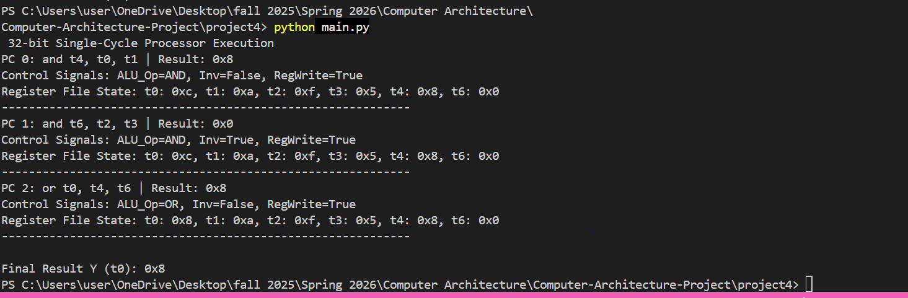

# Computer Architecture Project 4 Submission
By Ekene Okeke

# Single-Cycle Processor Design (AND / OR)

## Table of Contents 
1. Project Contents Overview
2. Installation and how to run the program

**Project Files:**
- project4/main.py: project 4 folder that contains the project4_ekene.py files that would be used to run the Single-Cycle Processor Design (AND / OR)
- aly.py - ALU
- control_unit.py - Control Unit
- datamemory - Data Memory
- im.py - Instruction Memory
- programcounter.py - Program Counter
- register_file.py - Register File
- main.y - Run the main program
- README.md

**Installation Steps:**
- Download file from github link
- cd to project 4 folder in the Terminal
- Run the following command: **python main.py**

**How to run processor:**

- Download project from ICollege or GitHub 

- CD to the project folder that contains: project 4 folder 
- run main.py and you should see the following out put for: 
# t0=A t1=B t2=C t3=D
Initial Values: A=12, B=10, C=15, D=5
    rf.registers['t0'] = 12  # A
    rf.registers['t1'] = 10  # B
    rf.registers['t2'] = 15  # C
    rf.registers['t3'] = 5   # D

expected output from  run 

**DEMO VIDEO LINK**
Link to the Demo video: [Project4demo](https://drive.google.com/file/d/1TbZp82ZxAI4h9GpBifTV4Xo2pxI1tfyn/view?usp=sharing)  need to change this later

